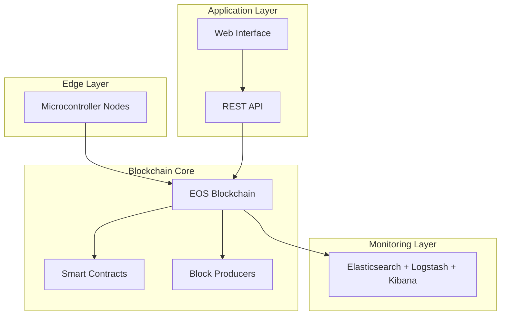
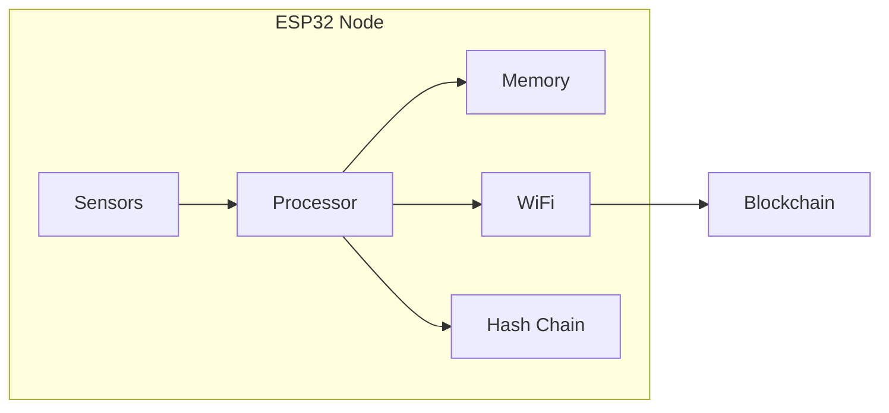

# Wine Blockchain Platform - Documentación Técnica

## Índice

1. [Arquitectura del Sistema](#1-arquitectura-del-sistema)
2. [Smart Contracts](#2-smart-contracts)
3. [Sistema de Monitorización](#3-sistema-de-monitorización)
4. [Nodos Microcontroladores](#4-nodos-microcontroladores)
5. [Despliegue](#5-despliegue)
6. [Seguridad](#6-seguridad)
7. [API Reference](#7-api-reference)
8. [Mantenimiento](#8-mantenimiento)

## 1. Arquitectura del Sistema

### 1.1 Visión General

La plataforma Wine Blockchain está construida sobre una blockchain EOS personalizada con los siguientes componentes principales:



### 1.2 Componentes Principales

- **Core Blockchain (EOS)**
  - Nodos productores de bloques
  - Smart contracts para tokenización
  - Sistema de consenso DPoS

- **Capa de Monitorización**
  - Elasticsearch para almacenamiento y búsqueda
  - Logstash para ingesta de datos
  - Kibana para visualización

- **Capa Edge**
  - Nodos microcontroladores ESP32
  - Sistema de hash encadenado local
  - Sincronización P2P

## 2. Smart Contracts

### 2.1 Bottle Token Contract

El contrato principal para la tokenización de botellas implementa:

- Creación de tokens únicos para botellas
- Sistema de transferencia de propiedad
- Registro histórico de eventos
- Verificación de autenticidad

#### Estructura de Datos

```cpp
struct wine_attributes {
    string winery;
    string vintage;
    string variety;
    string region;
    string bottle_number;
    uint64_t production_date;
    string batch_id;
    checksum256 bottle_hash;
};
```

#### Acciones Principales

| Acción | Descripción | Parámetros |
|--------|-------------|------------|
| create | Crea nuevo token | owner, attributes |
| transfer | Transfiere propiedad | from, to, bottle_id |
| addhistory | Añade evento histórico | bottle_id, event_type, details |
| updatestatus | Actualiza estado | bottle_id, new_status |

### 2.2 Interacción con Smart Contracts

Ejemplo de creación de token:

```bash
cleos push action bottletoken create '{
  "owner": "wineryacc1",
  "attributes": {
    "winery": "Bodega Example",
    "vintage": "2024",
    "variety": "Tempranillo",
    "region": "Rioja",
    "bottle_number": "BT001",
    "production_date": 1648684800,
    "batch_id": "LOT2024-001"
  }
}' -p wineryacc1@active
```

## 3. Sistema de Monitorización

### 3.1 Configuración de Elasticsearch

Índices principales:

```json
{
  "wine-blockchain-*": {
    "settings": {
      "number_of_shards": 1,
      "number_of_replicas": 1
    },
    "mappings": {
      "properties": {
        "timestamp": { "type": "date" },
        "transaction_type": { "type": "keyword" },
        "bottle_id": { "type": "keyword" },
        "actor": { "type": "keyword" }
      }
    }
  }
}
```

### 3.2 Visualizaciones Kibana

Dashboards predefinidos:

1. **Resumen General**
   - Transacciones por hora
   - Distribución de tipos de eventos
   - Mapa de calor de actividad

2. **Seguimiento de Botellas**
   - Timeline de eventos por botella
   - Estadísticas de transferencias
   - Alertas de manipulación

## 4. Nodos Microcontroladores

### 4.1 Arquitectura del Nodo



### 4.2 Especificaciones Técnicas

- **Hardware Compatible**
  - ESP32-WROOM-32
  - RAM: Mínimo 4MB
  - Flash: Mínimo 4MB

- **Requerimientos de Red**
  - WiFi 2.4GHz
  - Conexión estable mínima 1Mbps
  - Latencia máxima 200ms

### 4.3 Gestión de Eventos Local

Estructura de evento local:
```cpp
struct Event {
    char bottleId[32];
    char eventType[16];
    char hash[65];
    uint32_t timestamp;
    uint16_t prevEventIndex;
};
```

## 5. Despliegue

### 5.1 Requisitos del Sistema

- Ubuntu Server 22.04 LTS
- Docker 20.10+
- 16GB RAM mínimo
- 100GB SSD
- Procesador 4 cores

### 5.2 Proceso de Instalación

1. **Preparación del Sistema**
```bash
./scripts/install-dependencies.sh
```

2. **Configuración de Nodos**
```bash
./scripts/setup-node.sh producer1
./scripts/setup-node.sh producer2
```

3. **Despliegue de Monitorización**
```bash
docker-compose up -d
```

### 5.3 Verificación

Lista de verificación post-despliegue:

- [ ] Nodos sincronizados
- [ ] Smart contracts desplegados
- [ ] Elasticsearch accesible
- [ ] Kibana operativo
- [ ] Microcontroladores conectados

## 6. Seguridad

### 6.1 Modelo de Amenazas

| Amenaza | Mitigación | Impacto |
|---------|------------|---------|
| Suplantación | Firma digital | Alto |
| Manipulación datos | Hash chain | Alto |
| DDoS | Rate limiting | Medio |

### 6.2 Buenas Prácticas

1. **Gestión de Claves**
   - Rotación cada 90 días
   - Almacenamiento seguro
   - Backup cifrado

2. **Monitorización**
   - Alertas en tiempo real
   - Logs centralizados
   - Análisis de patrones

## 7. API Reference

### 7.1 Endpoints

#### Bottle Token API

```plaintext
POST /v1/chain/create_bottle
GET /v1/chain/get_bottle/{id}
POST /v1/chain/transfer_bottle
POST /v1/chain/add_event
```

#### Monitoring API

```plaintext
GET /api/stats/transactions
GET /api/stats/bottles/{id}/history
POST /api/alerts/configure
```

## 8. Mantenimiento

### 8.1 Tareas Rutinarias

- **Diarias**
  - Verificación de nodos
  - Backup de datos
  - Monitoreo de recursos

- **Semanales**
  - Rotación de logs
  - Actualización de índices
  - Limpieza de datos antiguos

- **Mensuales**
  - Actualización de software
  - Revisión de seguridad
  - Optimización de rendimiento

### 8.2 Troubleshooting

| Problema | Diagnóstico | Solución |
|----------|-------------|----------|
| Nodo desincronizado | `cleos get info` | Reiniciar nodo |
| Elasticsearch lento | Revisar índices | Optimizar shards |
| Microcontrolador offline | Check logs | Reset y reconexión |
